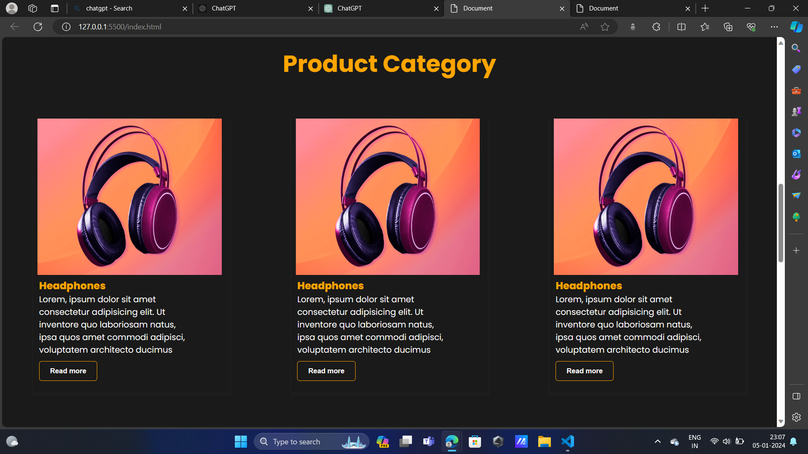

# Simple E-commerce Website for Headphones and Earphones

This project is a basic implementation of an e-commerce website for purchasing headphones and earphones. It is built using HTML, CSS, and JavaScript.

## Features

- Product listing for headphones and earphones
- Product details page with specifications and pricing
- Add to cart functionality with dynamic updates
- Responsive design for a seamless user experience on various devices

## Technologies Used

- HTML
- CSS
- JavaScript

## Folder Structure
├── index.html

├── styles.css

├── images/
│ ├── headphone1.jpg

│ ├── headphone2.jpg

│ ├── earphone1.jpg

│ └── earphone2.jpg

└── README.md

## Screenshots

1)Screenshot of the Home Page

](image.png)

2)Screenshot of the Product Details Page

3)Screenshot of about us page

4)Screenshot of Contact us page

